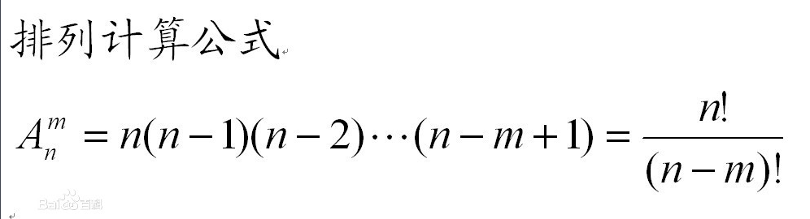
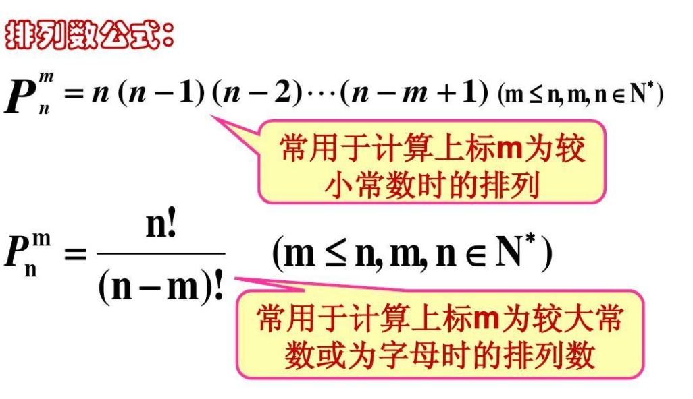
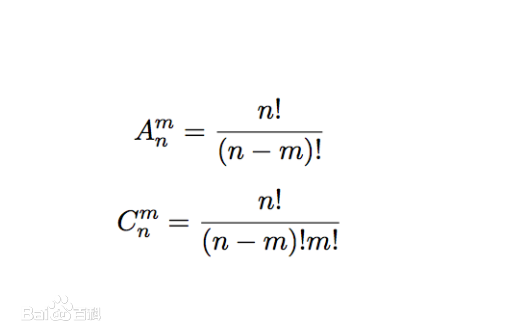

# 全排列

从n个不同元素中任取m（m≤n）个元素，按照一定的顺序排列起来，叫做从n个不同元素中取出m个元素的一个排列。当m=n时所有的排列情况叫全排列。

leetcode.46 给定一个没有重复数字的序列，返回其所有可能的全排列。

    输入: [1,2,3]
    输出:
    [
      [1,2,3],
      [1,3,2],
      [2,1,3],
      [2,3,1],
      [3,1,2],
      [3,2,1]
    ]

## 排列和组合的区别

问题是否和顺序有关,有关就是排列，无关就是组合.如231与213是两个排列，2+3+1的和与2+1+3的和是一个组合 

 - 排列 : 比如说排队问题甲乙两人排队，先排甲，那么站法是甲乙，先排乙，那么站法乙甲，是两种不同的排法，和先排还是后排的顺序有关，所以是 `A(2,2) = 2`种
 - 组合 : 从甲乙丙三个球中选2个，无论先取甲，在取乙，还是先取乙后取甲,取到的两个球都是甲和乙两个球，和先后取的顺序无关，所以是`C(3,2)=3`种
 
公式

 - 排列A(n,r)  从N里面取r个进行排列  A(n,r) = n(n-1)(n-2)...(n - r + 1 ) 带入公式 A(2，2) = 2 * 1 = 2
 - 组合C(n,r)  从N里面取r个进行组合  C(n,r) 
  
例如，`6`个不同的物品里面选`3`个来组合,有多少种情况？6个不同的物品里面选3个来排列有多少种情况？
  
解析:`6`个不同的物品里面选`3`个来组合，那么是不讲排列顺序的，有`20`种组合方式.
若要考虑每种组合的排列方式的话，则每一种组合分别有`6`种排列顺序，那么，6个不同的物品里面选3个来排列就有`20*6=120`种方式了。
故排列和组合的区别就是是否讲究顺序。

如果根据排列问题和组合问题画出的决策树树来观察，排列问题的树比较对称，而组合问题的树越靠右节点越少。

符号解释

 - C：组合数
 - A：排列数（在旧教材为P）
 - N：元素的总个数
 - R：参与选择的元素个数
 - !：阶乘，如5！=5×4×3×2×1=120
 - C：Combination 组合
 - P：Permutation排列 (现在教材为A-Arrangement)

## 排列中的约束条件

如果输入源是不重复的,那么结果自然不会重复.如果输入源是重复的,那么最终结果中 不同的排列情况会小于全排列情况

Q1. 从 `0,7,3`三个数字中任意选出两个数字组成两位数，有多少种不同的结果.

首先，判断是求 排列 还是 求 组合（可以枚举几种情况进行判断）.  `73` 与 `37` 属于两个不同的结果，本题在求排列.
然后，查验题目中是否有约束条件.  

 1. 两位数不能以0开头,总结果集中需要剔除以0开头的两位数.
 1. 结果集中不能包含相同的结果  因为输入源中不包含重复数字 那么结果中则不包含重复排列结果.

计算过程
 
    A(3,2) = 3 * ... (3 - 2 + 1) => 3 * 2 = 6 
    其中以0开头的两位数有两种 03 07 
    则最终结果为 4种

Q2. 从 `0,7,3`三个数字中任意选出两个数字，有多少种不同的结果.      

首先，判断是求 排列 还是 求 组合.  `73` 与 `37` 属于相同的结果，本题在求组合.
然后，查验题目中是否有约束条件. 

 1. 结果集中不能包含相同的结果  因为输入源中不包含重复数字 那么结果中则不包含重复排列结果. 
 
解题过程

     C(3,2) = (3!) / (2! * 1!)
     因为 1! 被规定为 1 
     所以
     
     C(3,2) = (3 * 2 * 1) / (2 * 1 * 1) = 3  
     答案为有 3 种组合方式      
     
## leetcode 题解

解一: 16ms

    class Solution {
    
        public $all_paths = [];
        public $cur_path  = [];
        /**
         * @param Integer[] $nums
         * @return Integer[][]
         */
        function permute($nums) {
            
            $used      = [];
    
            $this->backtrack($nums,$used);
            return $this->all_paths;
        }
    
        function backtrack($nums,$used) {
    
            // base case 
            // 选择列表为空 代表到达最底层 
            // 问题等价为 已走路径上的结点数 等于 层数
            if(count($nums) == count($this->cur_path) ){
                $this->all_paths[] = $this->cur_path;
                // $this->cur_path = [];
            }
    
            // 使用 used 来标识处理到 树中的第几层  （也就是横向思考时 ，处理到了第几个位置）
            // 当递归到最高层后, 将 路径 进行存储
            for($i = 0 ; $i < count($nums) ; ++$i) {
                
                if($used[$i]){
                    continue;
                } 
    
                // 标记 做选择 
                $used[$i] = true;
                $this->cur_path[] = $nums[$i];
                $this->backtrack($nums,$used);
    
                // 撤销选择 
                array_pop($this->cur_path);
                $used[$i] = false;
            }
    
        }
    }     
    
    
解二: 4ms

    class Solution {
    
        public $all_paths = [];
        public $cur_path  = [];
        public $used = [];
        public $res = [];
    
        /**
         * @param Integer[] $nums
         * @return Integer[][]
         */
        function permute($nums) {
            
            $this->backtracking($nums, []);
            return $this->res;
        }
        function backtracking($nums, $arr) {
    
                if (count($arr) == count($nums)) {
                    $this->res[] = $arr;
                    return;
                }
    
                foreach ($nums as $value) {
                    if (!in_array($value, $arr)) {
                        $arr[] = $value;
                        $this->backtracking($nums, $arr);
                        array_pop($arr);
                    }
                }
            }
    
    }