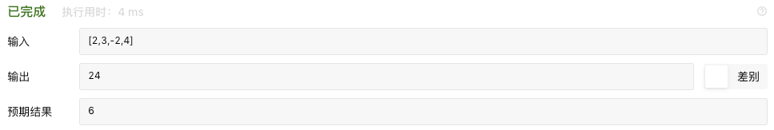

version.1  error version. 

    class Solution {
    
        /**
         * @param Integer[] $nums
         * @return Integer
         */
        function maxProduct($nums) {
    
            $dp_max = [];
            $dp_min = [];
    
            $dp_max[0] = $nums[0];
            $dp_min[0] = $nums[0];
            $size = count($nums);
            //$iMax = -99999;
            $iMax = $dp_max[0];
    
            for($i = 1;$i < $size ; $i++){
                
                // $dp_max[$i] = max($dp_max[$i - 1] * $nums[$i],$dp_max[$i - 1]);
                // 注意与 $nums[$i] 相比 才能保证连续，与 $dp_max[$i - 1] 比会出现跨越现象
                $dp_max[$i] = max($dp_max[$i - 1] * $nums[$i],$nums[$i]);
                $iMax = max($iMax,$dp_max[$i]);
            }
            
            var_dump($dp_max);
            return $iMax;
    
        }
    }
    

分析一下 
    
    var_dump($dp_max);
    array(4) {
      [0]=>
      int(2)
      [1]=>
      int(6)
      [2]=>
      int(6)
      [3]=>
      int(24)
    }
    
状态转移方程出了问题,题目要求连续乘积，我这么处理就相当于跨过了连续部分.这一部分是不能跨过的.

dp[i] 代表的是一 num[i] 结尾的连续子数组 的最大乘积. num[i]可能是正数 也可能是负数 

`[-10,-11,8,9]` 中 `[-10,-11]` 明显要大于 `[8,9]` ，所以单纯的使用 `max($dp_max[$i - 1] * $nums[$i],$nums[$i]);`
无法将 包含负数的子数组 考虑进来.上述只适用于非负数序列.(这也是考点,多数的题目都会对这里,状态的转移(如何选择状态，如何转移状态) 进行变种，以提升难度).

当中间存在负数,负数可以颠倒乾坤,导致最大的变最小的，最小的变最大的.所以我们需要额外维护一个 dp_min.
这样当乾坤颠倒时,最初最小乘积 * 负数 ，可能反而是最大乘积.(不到终局，焉知胜负)

下面进行修正.

 - 标签：动态规划
 - 遍历数组时计算当前最大值，不断更新
 - 令imax为当前最大值，则当前最大值为 imax = max(imax * nums[i], nums[i])
 - 由于存在负数，那么会导致最大的变最小的，最小的变最大的。因此还需要维护当前最小值imin，imin = min(imin * nums[i], nums[i])
 - 当负数出现时则imax与imin进行交换再进行下一步计算
 - 时间复杂度：O(n)O(n)

version.2 易理解版本

    class Solution {
    
        /**
         * @param Integer[] $nums
         * @return Integer
         */
        function maxProduct($nums) {
            
            // 明确状态方程 dp[i] 以$nums[$i]结尾的子数组的最大乘积
            $dp_max = [];
            $dp_min = [];
    
            $dp_max[0] = $nums[0];
            $dp_min[0] = $nums[0];
            $size = count($nums);
            //$iMax = -99999;
            $iMax = $dp_max[0];
    
            for($i = 1;$i < $size ; $i++){
    
                if($nums[$i] < 0 ){
                    $dp_max[$i] = max($dp_min[$i - 1] * $nums[$i],$nums[$i]);
                    $dp_min[$i] = min($dp_max[$i - 1] * $nums[$i],$nums[$i]);   
                } else {
                    $dp_max[$i] = max($dp_max[$i - 1] * $nums[$i],$nums[$i]);
                    $dp_min[$i] = min($dp_min[$i - 1] * $nums[$i],$nums[$i]);    
                }
    
                $iMax = max($iMax,$dp_max[$i]);
            }
    
            // print_r($dp_max);
            return $iMax;
    
        }
    }

时间复杂度 O(n)
空间复杂度 O(n)

version.3 上边可以对 空间复杂度进行优化

